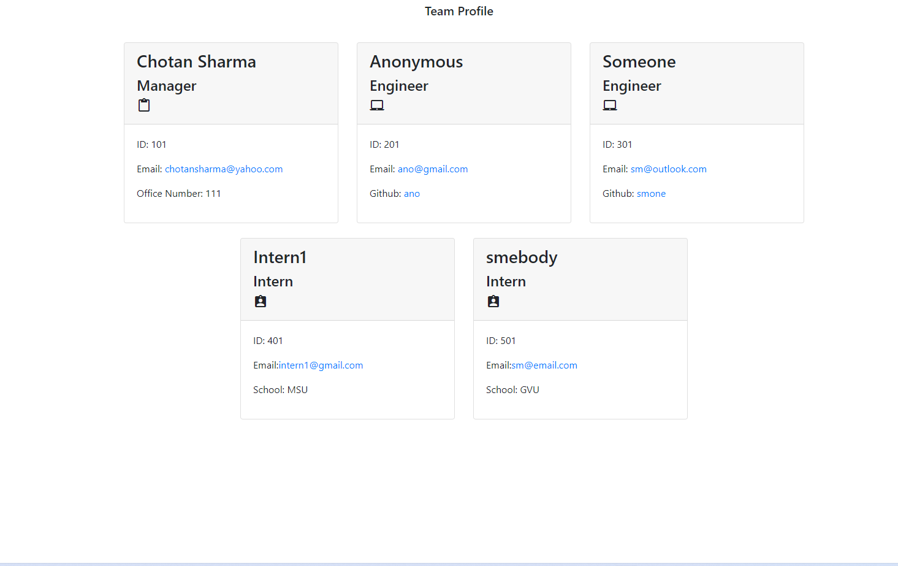

# make-a-team

## User Story:
AS A manager
I WANT to generate a webpage that displays my team's basic info
SO THAT I have quick access to their emails and GitHub profiles.

## Table of Contents
* [Description](#description)
* [Installation](#installation)
* [Usage](#usage)
* [License](#license)
* [Contributor](#contributor)
* [Assets](#assets)
* [Contact](#contact)

## Description
This application was created to generate a team profile based on user input using the Inquirer module from Node.js and displaying the information on a newly created html page with a style sheet. This project demonstrates use of OOP and TDD using Jest. 

## Installation 
To run this application, the users need to download node modules as well as file system modules and inquirer. For testing, this application uses jest.
## Usage 
Use inquirer from your command line to answer questions about your project.
View thw video: [Screencastify](https://watch.screencastify.com/v/5gYGffEkyuA4TEJQ4axo)
## License 
This project is license under MIT
## Contributor
Made with ❤️ by Chotan Sharma
## Assets

## Contact
Please  feel easy to contact me at chotansharma@yahoo.com. For more of my projects, you are aways welcome to my portfolio at https://github.com/ChotanSharma.